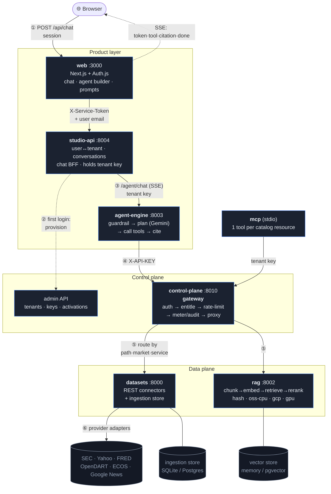

# Platform Architecture & Progress

> Detailed design + current state of the **Investment-Agent Data Platform**.
> Companion: [`ROADMAP.md`](./ROADMAP.md) (what's next). Entry point: [`../README.md`](../README.md).

---

## 1. Vision

A **multi-tenant platform for investment agents**: a data-source layer that each tenant activates to
their needs, exposed through four surfaces over one core —

- **REST** (the data plane API)
- **MCP server** (agents call data as tools)
- **RAG server** (retrieval over unstructured filings/news with provenance)
- **Agent Engine** (build/run agents via SDK or natural language) — *planned (P4)*

Builders develop against a defined interface **or** describe what they want in natural language and it
runs over the data sources they've activated. The flagship use case — supplier→customer **value-chain**
mapping — becomes a *user-cloneable agent template*, not a hardwired product.

**Reframe:** the legacy ValueGraph engine (`/services`, `/apps`, CVE, Deep-Research data acquisition) is
**excluded as a dependency**. We mine it for only two generic ideas (a Gemini router, the provenance
schema) and otherwise start fresh from `datasets/`.

---

## 2. System architecture — one picture

Six services run together (one `docker compose`, one shared `.env`). Every request fans **down** through
the gateway (which enforces auth · entitlement · metering on every hop) and real data flows **up** carrying
its provenance, which becomes the citations the user sees.

> Renders on GitHub and most Markdown viewers (solid = request path, dotted = first-login provisioning /
> the SSE stream back). The numbered steps ①–⑥ are spelled out below.

**Request flow (a chat turn).** ① the browser POSTs to the web BFF, which attaches the Auth.js session;
② on first login studio-api provisions a tenant/project/key + default activations via the control-plane
admin API; ③ studio-api streams the conversation to the agent engine with the **server-side tenant key**;
④ the agent plans (Gemini) and calls each tool **through the gateway** with that key; ⑤ the gateway
authenticates, checks the project activated the connector, rate-limits, meters, and proxies to `datasets`
or `rag` (chosen by path · market · `service`); ⑥ the provider adapter fetches from the real upstream (or
the ingestion store). External MCP clients hit the exact same gateway, so entitlement + metering are
identical no matter who calls.

**Tenant isolation in RAG.** `rag` is the one multi-tenant *store* (it holds ingested docs, not just
proxied upstream data), so when the gateway proxies to it, it injects `X-Tenant-Id` from the caller's
authenticated `project_id` (any client-supplied value is stripped — no spoofing). RAG stamps that tenant
onto ingested chunks and scopes search to **own-tenant OR global (unscoped)** docs: a tenant's ingested
news never surfaces in another's search, while a shared/seeded corpus (ingested without a tenant) stays
visible to all. The tenant key is an isolation dimension only — it's never part of user-facing provenance.

**Response / data flow.** Each datum and RAG chunk carries `source · as_of · url`; the agent turns those
into **citations**, the gateway stamps `x-connector` / `x-cost-units`, studio-api persists the assistant
message + citations, and the answer streams back to the browser as SSE (`token` → `tool` → `citation` →
`done`). A number never reaches the user without a source.

### What each service does · ports · dependencies

| Service | Port | Function | Depends on |
|---|---|---|---|
| **web** | 3000 | Next.js chat UI + agent builder + prompt library; `/api/*` BFF holds only an Auth.js session | studio-api |
| **studio-api** | 8004 | Google user → tenant provisioning, conversations, chat BFF (**holds the tenant key**) | control-plane (admin), agent-engine |
| **agent-engine** | 8003 | guardrail → plan (Gemini) → tool-calling loop → provenance citations; `/agent/run`, `/agent/chat` (SSE) | control-plane (gateway) |
| **control-plane** | 8010 | the **gateway**: auth → entitlement → rate-limit → meter/audit → proxy; tenants/keys/activations admin | datasets, rag |
| **datasets** | 8000 | REST data plane: connectors (SEC/Yahoo/FRED/DART/ECOS/News) + point-in-time ingestion store + `/catalog` | upstream APIs, (Postgres) |
| **rag** | 8002 | provenance-first retrieval: chunk→embed→store→retrieve→rerank; pluggable backends | (vector store, embed backend) |
| *mcp* | stdio | one tool per catalog resource, routed through the gateway with the tenant key (entitled + metered) | control-plane |
| **admin** | 8005 | Django-admin-style CRUD over every service DB (SQLAlchemy reflection + sqladmin) + ops console (scheduler · self-test · RAG · catalog). Out-of-band tool, not in the request path | controlplane/studio/datasets DB volumes |

The **catalog** (`datasets/app/connectors/`) is the keystone: each connector's manifest (resources, params,
provenance, license, `service`) is what the gateway entitles against, what the MCP server turns into tools,
and what the agent engine resolves tools from — so REST, MCP, and the agent all see one consistent surface.

---

## 3. Core principles

1. **Deterministic *data*, not deterministic *logic*** — "deterministic" describes the **data plane**:
   connectors are API-based, so figures are structured, fast, **reproducible, and always accurately
   sourced** (vs Deep Research, which is at most one optional tool, never the backbone). It does **not**
   mean the agent/reasoning logic should be hardcoded. **Answer quality and orchestration are achieved
   with Gemini (and, going forward, multi-agent flows) — never hand-rolled keyword/heuristic rules.** The
   the platform is Gemini-only — there is no keyword router anywhere; routing and synthesis are the model's.
2. **Provenance / trust envelope everywhere** — every datum, chunk, and (eventually) agent output
   carries `source` + `as_of` + `freshness` + **`cadence`** (+ `confidence` where derivable). No number
   without a source. **Cadence** is the datasource's periodicity, declared centrally in the catalog
   (`_CADENCE` map, enforced at load like `_CATEGORY`): `intraday`/`daily`/`event`/`scheduled`/`streaming`
   are **periodic**, `one_shot` is not. It rides the whole chain (catalog → agent-engine stamps it on
   citations/artifacts → the pinned widget `spec`) and **gates the pin→alert flow: only a periodic
   datasource can carry a notification bot once pinned.** One-shot data is a value you pin and glance at.
   The dashboard's root alert (`scope=board`, `digest`) summarizes a board's *periodic* widgets only.
3. **Platform-managed keys + metering/billing** → a **per-connector license / redistribution policy is
   mandatory** (SEC/DART/FRED redistribution-safe; Yahoo/news restricted → BYO-key).
4. **One router, one tenancy model** — don't fork the LLM router or auth across services.
5. **Honesty over fake data** — unbuilt endpoints return `501`; gaps are surfaced, never fabricated.

---

## 4. Components (current state)

### 4.1 Data plane — `datasets/`  ✅
A financial datasets API covering the US and Korean markets. Market chosen with `market=US|KR`.

- **Connectors (provider adapters + registry):** SEC EDGAR (US fundamentals/filings/earnings/insider/13F),
  Yahoo Finance (US+KR prices), FRED (US macro), OpenDART (KR fundamentals/filings/earnings/insider),
  BOK ECOS (KR macro), Google News (US+KR). Free/open defaults; paid adapters behind env keys.
- **Endpoints (real):** company facts, prices + snapshot, 3 financial statements (+ combined), filings,
  macro interest rates, financial-metrics snapshot, news, earnings, insider-trades, 13F (filer_cik),
  screener + line-items.
- **Ingestion store (`app/store/`):** SQLAlchemy point-in-time / restatement-aware `FinancialFact`
  (SQLite default, Postgres via `DATABASE_URL`). Backs the screener and deep history.
- **Bulk / deep backfill (`app/store/bulk.py`):** every annual+quarterly period from companyfacts
  (AAPL → 2007), full-universe via streaming SEC `companyfacts.zip`, KR via DART.
- **Scheduler (`app/scheduler.py`):** periodic refresh; `SCHEDULER_DEEP` for deep backfill;
  monitor/control at `/admin/scheduler`.
- **Self-test (`/admin/selftest`):** runs implemented endpoints in-process → pass/fail/skipped.
- **Catalog (P0, `app/connectors/`):** each connector publishes a **manifest** (resources, params,
  output schema, provenance, freshness, cost tier, required credential, **license policy**). `GET /catalog`.
- **Unbuilt endpoints** are grouped under a `🚧 Not Implemented (501)` tag in `/docs`.
- **62 tests.**

### 4.2 Control plane — `control-plane/`  ✅ (P1)
A gateway in front of the data plane. Package `controlplane` (talks to data plane over HTTP).

- **Store:** `Tenant → Project → ApiKey` (sha256-hashed, prefix lookup) + `Activation` (per-connector
  entitlement) + `UsageEvent` (metering) + `AuditLog`. SQLite default.
- **Entitlement:** fetches the data-plane `/catalog`, maps `(method, path, market)` → connector(s); a
  request is allowed iff the project activated one of them.
- **Gateway flow:** authenticate → entitle → rate-limit → proxy to data plane → meter + audit. Returns
  `x-connector` / `x-cost-units` headers; public `/catalog` passthrough.
- **Admin (X-Admin-Token):** create tenant/project/key, activate connectors, usage + audit summaries.
- **6 tests.** Verified live: activate `yahoo` → `/prices` 200; unactivated → 403; usage metered.

### 4.3 MCP server — `mcp/`  ✅ (P2)
Exposes connectors to agents as MCP tools (official `mcp` SDK, stdio). Package `mcpserver`.

- **Tool generation:** one tool per catalog resource (`{connector}__{resource}`), input schema from
  manifest params, description carries **provenance source + license** (NO-REDISTRIBUTE flag).
- **Execution:** routes through the control-plane gateway with the tenant's `MCP_API_KEY`, so
  entitlement + metering + audit apply. Unactivated connector → gateway 403 in the tool result.
- **Config:** per tenant in the MCP client (`MCP_GATEWAY_URL`, `MCP_API_KEY`).
- **4 tests.** Verified live: 28 tools; `yahoo__prices` (activated) → real data; `sec_edgar__*` → 403.

### 4.4 RAG service — `rag/`  ✅ (P3)
Provenance-first retrieval: **chunk → embed → vector store → retrieve → (optional) rerank**. Package `rag`.

- **Every chunk carries provenance** (source/doc_type/ticker/market/as_of/url/section/accession) → hits
  are citeable and consistent with connector data.
- **Pluggable backends via `RAG_*` env** (CPU-OSS / GCP / GPU, all behind one interface):

  | Part | env | options |
  |---|---|---|
  | embedding | `RAG_EMBEDDING_BACKEND` | `hash` (dev) · `oss-cpu` (fastembed ONNX) · `oss-gpu` (sentence-transformers CUDA) · `tei` (served) · `gcp` (Vertex `gemini-embedding-001`) |
  | reranker | `RAG_RERANKER_BACKEND` | `none` · `oss-cpu`/`oss-gpu` (BGE-reranker-v2-m3) · `tei` · `gcp` (Vertex Ranking API) |
  | vector store | `RAG_VECTOR_STORE` | `memory` (dev) · `pgvector` (prod) |

- **Endpoints:** `/rag/ingest`, `/rag/search` (hits + provenance), `/rag/info`.
- **Component approach** (we keep chunking + provenance) chosen over managed Vertex Search / RAG Engine,
  so the trust envelope stays uniform across structured + unstructured data.
- **Integrated into the platform:** a `rag` connector (manifest `service: "rag"`) is in the catalog →
  the gateway routes `/rag/search` to the rag service (entitled like any connector) and the **MCP server
  auto-exposes `rag__search`**. So agents get retrieval as a tenant-scoped, metered tool.
- **9 tests** on the dependency-free default. Verified live: real `oss-cpu` fastembed semantic search,
  and `/rag/search` through the gateway + MCP in the e2e run.

### 4.6 Agent Engine — `agent-engine/`  ✅ (P4)
Runs agents over a tenant's activated connectors + RAG. Package `agentengine`.

- **Loop:** guardrail → plan → call tool (through the gateway with the tenant key) → observe → finalize.
  Tools are resolved from the gateway catalog; every call is entitled + metered + audited by the control
  plane. Each tool result's provenance is collected into **citations** → sourced answers.
- **Guardrails:** refuses forecasts / price targets / buy-sell advice at the boundary ("not investment
  advice"; no prediction — matches the PRD's out-of-scope).
- **Planner (`AGENT_LLM_BACKEND`):** Gemini-only — `gemini` is the sole supported value (default; the env
  var is kept for compatibility). Real function-calling LLM; answer quality and step-budget assessment
  come from the model, not hardcoded rules (extra `gemini`, needs `GOOGLE_API_KEY` / Vertex). There is no
  keyword-routing fallback — the agent loop requires a key.
- **Builder modes:** declarative `AgentSpec` (system + allowed_tools + max_steps) and NL `/agent/compile`.
- **Endpoints:** `POST /agent/run` (X-API-KEY), `POST /agent/compile`, `GET /agent/info`.
- **7 tests.** Verified live (e2e): refuses advice; uses `yahoo__prices` via the gateway; cites Yahoo Finance.

### 4.7 Product layer — `studio-api/` + `web/`  ✅ (F0)
A Claude-style chat product over the platform.
- **`agent-engine`** gained `POST /agent/chat` (SSE): multi-turn, streams `token`/`tool`/`tool_result`/
  `citation`/`done`. Gemini planner; tool calls still go through the metered gateway.
- **`studio-api`** (`studioapi`): maps a Google-authenticated user → a platform tenant (provisioned via
  the control-plane admin API, with default connector activations), owns `conversations`/`messages`, and
  `POST /chat/stream` proxies the agent-engine SSE while persisting the turn. The tenant key is held
  **server-side**; the browser only has an Auth.js session. `agents`/`prompts`/`integrations` tables are
  seams for F1–F3.
- **`web`** (Next.js + Auth.js Google, dev-login fallback): streaming chat UI with an expandable **tools
  & sources** panel (citations + links). Its `/api/chat` route is the BFF (service token + user email →
  studio-api). Guardrails refuse advice/forecasting.
- Verified: web builds; `scripts/e2e.sh` drives a real chat turn through studio-api → agent-engine →
  gateway → datasets, returning a tool event + Yahoo Finance citation + a persisted conversation.

### 4.8 Agent builder — `studio-api` + `web`  ✅ (F1)
Users configure agents and run chats through them.
- **`AgentSpec`** (agent-engine) now carries `system`, `allowed_tools`, `max_steps`, and a per-agent
  `backend` (`gemini`). `get_planner()` resolves the Gemini planner; `filter_tools` accepts
  **connector ids** (`yahoo` → all its tools) as well as full tool names, so "data sources = connectors"
  maps cleanly to the activation subset. The system prompt is threaded into the planner.
- **`studio-api`**: `agents` CRUD (`/agents`, `/agents/{id}`) + 4 seeded **provided templates** (종합 리서치 /
  공시·실적 / 시황·가격 / 거시경제, `user_email = NULL`, read-only → clone to edit); `GET /connectors`
  proxies the catalog for the data-source picker. `/chat/stream` accepts `agent_id` → loads the agent →
  `agent_to_spec` → sends `spec` to `agent-engine`; the conversation stores its `agent_id`. Agents are
  per-user scoped; templates are shared.
- **`web`**: an agent picker (templates + my agents) in the chat header and a builder modal
  (name / model / system prompt / data-source checkboxes). BFF routes `/api/agents`, `/api/agents/[id]`,
  `/api/connectors` (service token + user email → studio-api). The chat sends `agent_id`.
- Verified: e2e creates an agent restricted to `sec_edgar` and asks a price question — the answer uses an
  SEC tool and **never** reaches `yahoo`, proving the data-source restriction is enforced end-to-end.

### 4.9 Prompt library — `studio-api` + `web`  ✅ (F2)
Reusable prompts: a personal collection + a seeded community catalog.
- **`studio-api`**: `prompts` CRUD (`/prompts`, `/prompts/{id}`); `GET /prompts/community` returns the
  seeded read-only catalog (`user_email = NULL`); `POST /prompts/{id}/import` clones a community prompt
  into the user's library — **idempotent** (re-import returns the same copy) and records `source_id` for
  provenance. Personal prompts are per-user scoped; community ones are shared and not editable/deletable.
- **`web`**: a prompt-library modal with **내 프롬프트 / 커뮤니티** tabs — create/edit/delete personal prompts,
  import community ones, and **사용** drops the prompt body straight into the composer. BFF routes
  `/api/prompts` (+ `[id]`, `[id]/import`, `community`).
- Verified: e2e lists the community catalog, imports one prompt, and asserts an editable copy with its
  `source_id` appears in the personal library.

### 4.5 Keystone — the Connector Manifest
A machine-readable descriptor per connector (`datasets/app/connectors/`). One artifact drives:
REST docs · **MCP tool generation** · RAG source registration · entitlements (activation) · metering
(cost tier) · governance (license policy). An integrity test asserts every manifest path is a real route.

---

## 5. Multi-tenancy, governance & licensing

- **Tenancy:** Tenant → Project → scoped API key; activation per connector is the entitlement unit.
- **Metering/billing:** every gated call writes a `UsageEvent` with cost units by connector tier.
- **Governance (critical, platform-managed keys + redistribution):** each connector carries a
  `license.redistribution` flag (yahoo + news = false). The catalog exposes it; the control plane is the
  enforcement point. **Open item:** wire redistribution enforcement + BYO-key fallback + professional
  legal review before external multi-tenant use.

---

## 6. Deployment

- **One command:** `docker compose up --build` → data plane (`:8000`) + control-plane
  gateway (`:8010`), both reading **one shared `.env`** (compose `env_file`).
- **Single env:** every service reads `env_file=("../.env", ".env")` — shared `.env` first,
  optional per-service override. `.env` is gitignored; `.env.example` is the template.
- **Stores:** SQLite by default (persistent compose volumes); `DATABASE_URL` → Postgres in prod.
- MCP runs over stdio (launched by the MCP client, not in compose). RAG runs standalone (`:8002`).

---

## 7. Testing summary

| Service | Tests | Notes |
|---|---|---|
| datasets (data plane) | 63 | mapping, XBRL/DART parsers, TTM, screener, scheduler, catalog integrity, rag connector |
| control-plane | 12 | auth+key isolation, entitlement resolver, rate-limit, gateway 401/403/200+metering/429, rag routing, audit log |
| mcp | 9 | tool generation (incl. `rag__search`), call success, unentitled 403, GET params/POST body, key-header omission, import |
| rag | 14 | chunking, hash embedder, ingest→search+provenance, market/ticker filter, top_k, relevance ranking, reranker, factory |
| agent-engine | 21 | guardrails, tool-use+citations, forecast refusal, rag routing, **connector-level filter**, **per-agent backend**, **system passthrough**, chat stream |
| studio-api | 24 | service-token guard, provisioning resilience, conversation scoping, agents CRUD + templates, connectors proxy, chat-with-agent spec, **prompts CRUD + community import** |
| web | build | Next.js typechecks + builds (Auth.js, chat UI, **agent builder**, **prompt library**, BFF) |
| **unit total** | **143** | (+ web build) |
| **e2e** (`scripts/e2e.sh`) | — | full stack via compose: catalog → tenant → entitlement → data plane + RAG via gateway → metering → MCP → agent → studio-api chat → agent builder (data-source subset) → **prompt-library community import** |

---

## 8. Verified live (end-to-end)

- Data plane: real US+KR data (AAPL 2007→ history, Samsung financials, Berkshire 13F, BOK base rate…).
- Gateway: tenant → activate `yahoo` → real AAPL price through control-plane → datasets; `sec_edgar` 403.
- MCP: 28 tools from the catalog; activated tool → real data; unactivated → 403.
- RAG: real `oss-cpu` (fastembed) semantic search with provenance.
- Compose: both containers healthy; real SEC data across the two containers from one shared `.env`.
