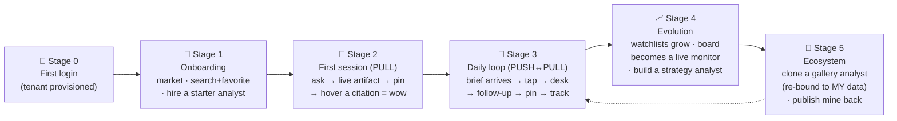

# UX Specification — Investment Research Desk

> **What the product *feels* like, screen by screen, and the user journey that ties it together.**
> Companions: [`ARCHITECTURE.md`](./ARCHITECTURE.md) (how the services work) ·
> [`ROADMAP.md`](./ROADMAP.md) (the single prioritised plan — what to build, in order).
> Engineering rules: [`../CLAUDE.md`](../CLAUDE.md).
>
> User-facing copy in this doc is illustrative Korean (the Terminal is KR-localized); keep all
> user-visible strings in an i18n layer, never hardcoded.

---

## 1. The one idea

We are **not a chatbot**. We are a **personal research desk** where the user *staffs standing
analysts* (agents) on their own universe of companies. Every analyst works **only from licensed,
point-in-time, fully-cited data**, and **pushes what changed before being asked**.

A general LLM is **stateless, source-weak, and reactive**. The three things it structurally cannot do
are exactly our product:

| Pillar | What it means | Where it shows up |
|---|---|---|
| **Trust by construction** | No number reaches the user without a highlighted, dated, fresh source. | Inline live artifacts (§5.2) · source-preview cards (§5.3) · freshness/confidence legend (§7) |
| **Pull → Push** | The desk *remembers my context* and *wakes up for me* (schedule + disclosure calendar). | Watchlists & @groups (§5.4) · standing analysts (§5.5) · morning briefs (§5.6) |
| **A desk you can staff from others** | Clone a published analyst; it re-binds to *my* data; outputs stay auditable. | Gallery + clone/substitution (§5.7) |

**Guardrails are a feature, not fine print.** Forecasts, price targets, and buy/sell advice are refused
at the boundary and the refusal is *shown* ("맥락 정보 — 전망/추천 아님"). This is the trust brand.

---

## 2. Personas

- **The self-directed retail investor (primary).** Follows 10–40 names, reads filings/news irregularly,
  wants to *stop missing things* and *stop trusting unsourced AI answers*. Korean-first.
- **The power user / strategy builder.** Codifies a screen + thesis ("저PER·자사주매입·매출성장>15%")
  into a recurring monitor; publishes analysts for others.
- **The lurker / cloner.** Doesn't build; browses the gallery and clones a good analyst onto their own
  watchlist.

---

## 3. The journey arc (this is the part that makes it a product, not a demo)



The loop is the point: **push surfaces something → user digs in the desk (pull) → pins it (persist) →
tells the analyst to keep watching it (refine)**. Each pass makes the desk more *theirs*, which is the
moat a stateless chatbot can't copy.

### 3.1 Stage 0 — First login (cold start is the enemy)
- Google sign-in → studio-api provisions tenant/project/key + default activations (already built).
- **Never drop a new user on an empty desk.** Route straight into onboarding.

### 3.2 Stage 1 — Onboarding (target: < 90s to first value)
1. **시장 선택** — US · KR · 둘 다. (Sets default `market` everywhere.)
2. **관심 종목 채우기** — two paths, both end in a first **watchlist**:
   - *관심사 칩*: 반도체 · 2차전지 · AI · 바이오 · 금융 … → tapping a chip suggests 5–8 representative
     listed names (logo + 티커) to favorite in one tap.
   - *직접 검색*: the stock search (§5.4) — type "삼성", pick from autocomplete, ⭐ favorite.
   - Favorited names land in a default group **`@관심`** (renameable; the `@`-handle is the group name).
3. **추천 분석가 고용** — show one Gallery template (e.g. "데일리 브리프") **pre-bound to the watchlist
   just created**. One tap = *고용*. Copy: "매일 아침 8시, 첫 브리프가 도착해요."
4. **Land on the Desk — not empty.** A seeded artifact greets them: a "내 관심 한눈에" card (logos,
   live price 🟢, last filing date per name). The desk already feels populated and sourced.

> Onboarding deliberately exercises **search+favorite → watchlist → hire analyst → first sourced
> artifact** so the user has touched all three pillars before they've typed a question.

### 3.3 Stage 2 — First session (PULL)
- User asks a question in the Desk → agent answers with an **inline live artifact** (§5.2) and **inline
  citation chips** (§5.3).
- **The wow:** hover/tap a citation → a source-preview card with the *verbatim highlighted span* of the
  filing, `as_of`, and a freshness dot. "It actually shows me the exact line in the 10-K." → 📌 pin the
  artifact to the Board.

### 3.4 Stage 3 — Daily loop (PUSH ↔ PULL)
- Next morning a **brief** arrives (in-app `🔔` inbox + Telegram, same card format, §5.6). Every figure
  carries `[n]`; the header states *why it fired* ("실적 D-2", "거래량 2.1x").
- Tapping a brief line **deep-links into the Desk pre-loaded with that context** → user asks a follow-up
  → pins the result → optionally hits **"이걸 매일 추적"**, which appends a watch rule to the analyst.

### 3.5 Stage 4 — Evolution
- Watchlists grow, split, merge; a company can sit in several groups.
- As the user activates more connectors, analysts can use more data sources.
- The **Board** accrues pinned, auto-refreshing artifacts → a personal live monitor.
- The user codifies a **strategy analyst** (screener-backed, §5.5) — a recurring monitor, *not* a signal
  generator (guardrails hold).

### 3.6 Stage 5 — Ecosystem
- The user **clones** a Gallery analyst; the **binding wizard** (§5.7) swaps the template's abstract
  slots for *their* watchlist / activations / channels → a personal instance.
- The user **publishes** a refined analyst back: it is **re-abstracted** (private watchlist stripped →
  slots; required connectors + cost declared; `sourced · no-forecast · auditable` badges).

---

## 4. Information architecture / app shell

Evolves today's `web` (chat + tools&sources panel + builder/prompt modals) into a **desk** with a slim
left rail. Each rail item is a place the user *returns to*, which is what makes it feel persistent.

```
┌────┬─────────────────────────────────────────────────────────┬──────────────┐
│ 🏠 │  ▸ 분석가:  🟢 반도체 데일리  ▾        [ ⚙ 편집 ]  [ ↗ 공유 ] │  LIVE 컨텍스트│
│데스크│─────────────────────────────────────────────────────────│              │
│ 📊 │                                                         │ ⭐ 반도체바스켓 │
│ 보드│   (대화 + 인라인 artifact 카드가 쌓이는 중앙 영역)            │  필터됨        │
│ 🧑‍💼 │                                                         │ • 삼성 3Q 잠정 │
│분석가│                                                         │   실적 (DART) │
│ ⭐ │                                                         │   2시간 전 🟢 │
│ 관심│─────────────────────────────────────────────────────────│ • SK 증설뉴스 │
│ 🔔 │  ┌───────────────────────────────────────────────────┐  │   어제 🟡     │
│브리프│  │ 무엇이든 물어보거나, /프롬프트 · @그룹 호출            ↑│  │              │
│ 🛒 │  └───────────────────────────────────────────────────┘  │ ※ 점수·전망 X │
│갤러리│     @반도체바스켓  /실적요약   📎 소스 4   🟢 fresh          │   원문만       │
└────┴─────────────────────────────────────────────────────────┴──────────────┘
```

| Rail | Screen | Purpose |
|---|---|---|
| 🏠 데스크 | Chat + inline artifacts | the pull surface; talk to the active analyst |
| 📊 보드 | Pinned artifact grid | persistent, auto-refreshing personal monitor |
| 🧑‍💼 분석가 | My analysts | chat agents + standing analysts; create/edit/hire |
| ⭐ 관심 | Watchlists / @groups | search + favorite; the `@`-taggable unit |
| 🔔 브리프 | Brief inbox | everything analysts pushed (read/unread) |
| 🛒 갤러리 | Gallery | browse · clone · publish analysts |

The **Prompt library** (built, F2) stays as a composer affordance (`/` to insert), not a rail item.

---

## 5. Screens

> **Visual spec & design system.** The full-size mockups live in `wireframes/screens.dc.html` (7 screens) and
> `wireframes/community.dc.html`; the implemented visual language (tokens + primitive components every screen
> composes) is **`DESIGN_SYSTEM.md`** — read it before building any screen so the language stays unified.
> Desk + Live Context are already built to this system (light grayscale, `ui.tsx` primitives, native source
> previews + expand viewer); the rest map to ROADMAP `U4/U5/U0/U6` (+ unblocked `U-SHELL-POLISH`).

### 5.1 The Desk (chat) — current screen, evolved
- Active **analyst** named in the header (not "model"); switching analysts switches system prompt +
  allowed data sources + persona.
- Composer affordances: `/` → prompt library · `@` → watchlist group · `📎 소스 N` live count ·
  freshness dot for the freshest source in scope.
- Right panel = **Live Context Feed** (today's tools&sources panel, reframed): raw news/filings,
  entity-linked, filtered when a company is selected. Hard label **"점수·전망 없음 / 원문만"**.

### 5.2 Inline live artifact (the chart/table feature)
Every figure the agent computes renders as an **interactive card inside the answer**, backed by a
connector (not a snapshot).

```
┌── 📈 매출총이익률 (GPM), FY20–FY25 ────────── 핀 📌 │ 새로고침 ↻ ──┐
│   삼성전자 ──  SK하이닉스 ──  마이크론 ··                          │
│   (차트)                                                       │
│  출처: SEC EDGAR · OpenDART  │  as_of 2026-05-14  │  🟢 fresh 31일 │
└────────────────────────────────────────────────[1][2] 표로 보기 ⇄─┘
```
- **Card footer is a trust line** — `출처 · as_of · freshness`, mandatory on every card.
- **Gaps are drawn**, never omitted (dashed segment + `⚠` note for unfiled periods).
- Controls: `📌핀` → Board · `↻새로고침` → re-call the connector (proves it's live) · `⇄표로 보기` →
  same data as a table · per-series `[n]` → source preview.
- **Agent picks the visual** from the data shape (time series · small-multiples · comparison · mini
  value-chain graph). A refused request (forecast/advice) renders **no** artifact — just the refusal.
- Artifact is a **typed spec** the agent emits (`{kind, series, provenance[]}`), the web renders it; this
  keeps rendering deterministic and the provenance attached. See `ROADMAP.md` U3.

### 5.3 Source-preview card (THE signature trust moment — build first)
An inline citation chip `[1]` on hover (desktop) / tap (mobile) opens a **type-specific** popover;
dragging it pins it into the right panel.

**(a) Filing / disclosure — verbatim highlight**
```
┌──────────────────────────────────────┐
│ 📄 삼성전자 3분기 분기보고서 · DART      │
│ 2024-11-14 접수 · p.42 「매출원가」      │
│┌────────────────────────────────────┐│
││ … 메모리 부문 매출원가율은 전년 동기    ││
││ ▌대비 8.2%p 개선된 61.3% 를 기록▐    ││ ← 인용 구절 하이라이트 (verbatim span)
││ 하였으며 …                          ││
│└────────────────────────────────────┘│
│ 🟢 fresh · 31일 전 · 다음 공시 11/14    │
│ [ 원문 열기 ↗ ]   [ 패널에 고정 📌 ]    │
└──────────────────────────────────────┘
```
**(b) Price / metric — connector + computation + next refresh**
```
│ 💹 매출총이익률 31.2% (FY24)
│ 계산: GP 95.6조 ÷ 매출 300.9조
│ 소스: OpenDART 재무제표 (감사받은 사업보고서)
│ as_of 2025-03-11 · 🟢 fresh · 다음 갱신: '26 1Q
│ [ 계산 근거 펼치기 ▾ ]
```
**(c) News — snippet + published time + "context only" label**
```
│ 📰 "SK하이닉스, HBM4 양산 앞당겨" · Google News
│ 한국경제 · 2026-06-13 09:12
│ "…내년 상반기로 계획했던 HBM4 양산을…"
│ 🟡 aging · 1일 전   ⓘ 맥락 정보 — 전망/점수 아님
│ [ 기사 열기 ↗ ]
```
This is what beats Perplexity-style citations: **point-in-time**, **verbatim-span highlight**,
**freshness + next-update**, and **type-aware** previews.

> ✅ **Built (and extended).** The Live Context panel renders each cited source as a **native preview with the
> cited passage highlighted** — filing → mini PDF page (page badge + amber highlight over skeleton text),
> web/news → browser chrome (URL bar from the real host) + headline + highlight, data → extracted card.
> Clicking a preview opens the **full source viewer** (`SourceViewer.tsx`, wireframe Screen 08): the source
> full-size with the passage highlighted + margin pin, and a "이 원문을 인용한 곳" panel (freshness / as_of /
> source · 원문 열기 ↗ · 인용 복사). We render only the extracted snippet + a link (no full-text redistribution);
> surrounding text is skeleton. **Next (U6):** apply the same native-preview + viewer to community footnotes
> and Data-Hub RAG chunks. Components: `SourceCard.tsx` (`.srcprev`), `SourceViewer.tsx` — see `DESIGN_SYSTEM.md`.

### 5.4 Watchlists & @groups (search + favorite — yes, the user searches)
**Stock search** (autocomplete over the company universe):
```
┌ 종목 검색 ───────────────────────────────────┐
│ [ 삼성|                                    🔍]│
│ ─────────────────────────────────────────── │
│  [로고] 삼성전자        005930 · KR   ₩… 🟢 ⭐ │
│  [로고] 삼성SDI         006400 · KR   ₩… 🟢 ☆ │
│  [로고] 삼성바이오로직스  207940 · KR   ₩… 🟢 ☆ │
└───────────────────────────────────────────────┘
```
- ⭐ toggles favorite → asks which group (default `@관심`) or **create a group inline** (the new name
  becomes its `@`-handle). A company may belong to multiple groups.
- **Watchlists screen**: list of groups; rename (changes the @handle), merge, remove items; each group is
  the unit that `@` tags in the composer and that a standing analyst's `targets` slot binds to.
- **Data needs:** a company **search/autocomplete** endpoint in `datasets` (today there's only
  `/company/facts/tickers`; a name-indexed search is a new task) + new `Watchlist`/`WatchlistItem`
  tables in `studio-api`. See `ROADMAP.md` U1.

### 5.5 Standing-analyst builder ("hire a person", not "configure a bot")
Extends today's builder modal (name/model/system/data-source checkboxes) with **target group, schedule,
triggers, channels** — NL-first, with a two-way structured form.

```
┌─ 분석가 만들기 ─────────────────────────────────────────┐
│ 이름 [ 반도체 데일리 ]   아이콘 🟢                        │
│ 무슨 일을 시킬까? (자연어)                                │
│ ┌─────────────────────────────────────────────────────┐│
│ │ 매일 아침 8시, @반도체바스켓 의 전날 가격변동과 신규       ││
│ │ 공시·뉴스만 요약. 실적·공시 D-3이면 먼저 알려줘.          ││
│ └─────────────────────────────────────────────────────┘│
│   ↓ 파싱 → 아래 자동 채움 (양방향 편집)                    │
│ 대상      ⭐@반도체바스켓 (삼성·SK·DB하이텍…5)   [바꾸기]   │
│ 데이터소스  ☑가격 ☑공시 ☑뉴스 ☐거시 ☐13F  ⓘ활성화된 것만  │
│ 트리거     ⏰ 매일 08:00 (Asia/Seoul)                     │
│           ＋ 📅 공시·실적 D-3 (Disclosure Calendar)       │
│ 채널       ☑ 인앱 브리프  ☑ Telegram  ☐ 이메일            │
│ 출력형식    ◉ 브리프  ○ 표만  ○ 원문 링크만               │
│ 🛡 매수/매도·목표가·전망은 자동 거절 (끌 수 없음)           │
│       [ 미리보기 실행 ▷ ]   [ 취소 ]   [ 고용하기 ]        │
└─────────────────────────────────────────────────────────┘
```
- **NL ↔ form is two-way**: writing in the box fills the form (via `/agent/compile`); editing the form
  rewrites the summary.
- `데이터소스` lists **only activated connectors** (entitlement 1:1). A **strategy analyst** binds the
  screener (`/search/screener`) as its core tool instead of a watchlist.
- **Data sources are toggleable AND expandable — expose the tools inside.** A connector groups several
  tools; each connector row expands (▸) to reveal its **tools with a plain-language "what it does"**
  (e.g. `datasets_store` → `metrics_history` "기간별 재무비율 추이", `screener`, `line_items`; `sec_edgar`
  → `as_reported` "공시에 보고된 원본 XBRL 항목", `filings`, `company_facts`, …). Tool list + descriptions
  come from the catalog `resources` (already in `/catalog`) — **no new data, just surface it.** This is on
  brand: showing *exactly* what each analyst can touch is trust-by-construction. *(Selection stays at the
  connector level; the expansion is for transparency. Per-tool selection is a possible later refinement.)*
- **트리거 is a first-class concept**: cron + **Disclosure-Calendar event (D-3)** — this is the engine of
  push. Requires a disclosure-calendar endpoint (new task) + a scheduler that runs the agent headless.
- **미리보기 실행** runs once before hiring → "지금 돌리면 이런 브리프가 옵니다" → trust before commit.

### 5.6 Morning brief (the push output — in-app + Telegram, one format)
```
┌─ 🔔 반도체 데일리 · 2026-06-14 08:00 ──────────────┐
│ 어젯밤 바스켓 5종목, 주목할 3가지                    │
│ 1. 📅 삼성전자 — 잠정실적 D-2 (6/16)                │
│      직전 분기 매출 79.1조[1] · 컨센서스[2]          │
│ 2. 📈 SK하이닉스 +4.2% (전일) · 거래량 2.1x          │
│      트리거: HBM4 양산 보도[3] 🟡                    │
│ 3. ⚪ DB하이텍 — 신규 공시/뉴스 없음                 │
│ 📎 모든 수치 소스 첨부 · ⛔ 전망/추천 없음            │
│ [ 데스크에서 자세히 ↗ ]   [ 이 브리프 조정 ⚙ ]       │
└────────────────────────────────────────────────────┘
```
- Accumulates in the `🔔 브리프` inbox (read/unread); Telegram gets the same card (F3 channel).
- Every figure carries `[n]`; **the header states why it fired** — the thing a chatbot never does.

### 5.7 Gallery + clone/substitution (import → MY data)

A published analyst is a **TEMPLATE**, never the author's private state. It declares typed **slots**:

```
AnalystTemplate {
  name, description, author, version, badges:[sourced, no-forecast, auditable]
  spec:           system_prompt / NL intent
  slots: {
    targets:       { kind:"watchlist", required:true, hint:"볼 종목 그룹" }
    data_sources:  ["yahoo","sec_edgar","news"]          // required connectors (+ license class)
    triggers:      [{type:"cron", default:"0 8 * * *"}, {type:"disclosure", default:"D-3"}]
    channels:      [{type:"inapp", default:true}, {type:"telegram", default:false}]
    output_format: "brief"
  }
  cost_estimate:   "~12 units/run"
}
```

**Cloning = a binding wizard** that maps every slot to the user's resources and produces a personal
**INSTANCE** (`source_id` + `source_version` recorded for provenance — the same pattern already used by
prompt-import, kept consistent):

```
┌─ 「반도체 데일리」 데려오기 ─ 4단계 ──────────────────────┐
│ 1) 대상 종목                                            │
│    이 분석가는 종목 그룹 1개를 봅니다.                     │
│    ◉ 내 그룹에서 선택  → [ ⭐@반도체바스켓 ▾ ]            │
│    ○ 새 그룹 만들기    → (검색+즐겨찾기 인라인)            │
│    ○ 샘플 그룹으로 체험                                  │
│ 2) 데이터 소스                                          │
│    필요: 가격 ☑활성화됨   공시 ☑활성화됨                 │
│         뉴스 ⚠ 제한 피드 → [ 내 키 입력 ] 또는 [ 건너뛰기]│
│ 3) 트리거·채널   ⏰08:00 ☑  📅D-3 ☑   ☑인앱 ☐Telegram   │
│ 4) 미리보기 실행 ▷  → (바인딩된 슬롯으로 1회 실행 결과)     │
│                          [ 뒤로 ]   [ 내 분석가로 추가 ] │
└──────────────────────────────────────────────────────────┘
```

Rules:
- The instance is **decoupled** from the author — the author's later edits never overwrite it (fork
  semantics). A later "업데이트 확인" can diff the new template version (optional, post-v1).
- **Restricted feeds** (yahoo/news, `license.redistribution=false`): the wizard requires **BYO-key** or
  lets the user skip that source (the analyst then degrades gracefully and says so).
- **Publishing back** re-abstracts: strip the bound watchlist → `targets` slot; list the connectors the
  analyst actually used → `data_sources`; compute `cost_estimate`; attach badges. Private data never
  leaves the tenant.

This is the concrete answer to *"카드를 import하면 내 데이터로 어떻게 치환되나"*: **template slots → my
watchlist + my activations + my channels = my instance, with provenance back to the source.**

### 5.8 Analyst list page (분석가 destination) — *frontend-now, ROADMAP U-SHELL-POLISH*
The rail's `분석가` destination (currently a "곧" placeholder) becomes a real page: **my analysts** — chat
agents + (later) standing analysts in one list, each with its pixel variant so it reads like "my staff".
Per row: name, status dot, residency line (`상주 · 매일 08:00 · @반도체바스켓` — schedule shown once U4 lands),
`ON` toggle; `＋ 만들기` and `갤러리에서 데려오기`. Opens the existing builder modal. The **list ships now**
from `/api/agents` (chat agents + create/edit/clone); residency/schedule badges wait on U4's push backend.
Spec: `wireframes/screens.dc.html` Screen 3. Compose `ui.tsx` (Card/Chip/Button/Mascot/FreshnessDot).

### 5.9 Source viewer (preview → full source) — *built (SourceViewer.tsx)*
Clicking a Live Context preview (§5.3) expands it into a modal over the dimmed desk: type tabs
(공시/뉴스/데이터), the source full-size with the cited passage highlighted + a margin pin, and a right
**"이 원문을 인용한 곳"** panel — which artifact/answer cited it, freshness, as_of, source — with `데스크
대화로 ↗` (jump back), `원문 열기 ↗`, `인용 복사`. The reusable trust pattern for §5.10 (community) too.
Spec: `wireframes/screens.dc.html` Screen 08.

### 5.10 Community / Insights — *ROADMAP U6 (lowest priority)*
The ecosystem pillar: users author **blog-style insights** with embedded **LIVE artifacts** (fresh at
read-time, not screenshots), share, earn upvotes/scraps/followers, build reputation. Screens (full spec in
`wireframes/community.dc.html` + `wireframes/community.dc.html`): **Feed** (인기/팔로잉/신규 + 명예의 전당
leaderboard), **Composer** (block editor, drag Board artifacts to embed, RAG auto-footnotes, pre-publish
sources/no-forecast gate, "논리를 분석가로 변환"), **Reader** (upvote · scrap-to-collection · discussion ·
"내 보드로 복제"; footnotes = native source previews + 펼치기 → §5.9 viewer), **Author profile** (reputation ·
badges), **Scrapbook** (collections, highlights), **Data Hub** (RAG 자료실 with evidence-chunk previews + MCP
connector status; private PDFs never leave the tenant). **Design principle:** data signals stay trust-color
(green/amber/red); **people/social signals are indigo** (`--accent`) — two signal systems kept separate.
Reuses `SourceCard`/`SourceViewer` + `ui.tsx` primitives (`DESIGN_SYSTEM.md`). Relates to `IDEA.md` Insight Canvas.

---

## 6. End-to-end interaction example (ties the pillars together)

1. Onboarding: search "삼성" → ⭐ → group `@반도체바스켓`; hire the "데일리 브리프" template bound to it.
2. Tomorrow 08:00: Telegram brief — "삼성 실적 D-2, SK +4.2% (HBM 보도)". Every line sourced.
3. Tap the SK line → Desk opens pre-loaded → "SK하이닉스 HBM 매출 비중 추이?" → inline GPM/segment
   artifact + `[1]` citation.
4. Hover `[1]` → DART 사업보고서 p.31, the revenue-mix sentence highlighted, 🟢 28일 전, 다음 공시 날짜.
5. 📌 pin to Board. Click **"이걸 매일 추적"** → the analyst gains a watch rule for SK's segment mix.
6. Later: publish the tuned analyst to the Gallery → others clone it onto *their* watchlists.

---

## 7. Design system (cross-screen invariants)

> **Implemented system of record: `DESIGN_SYSTEM.md`** (tokens + the `ui.tsx` primitive components every
> screen composes). This section is the *intent*; that doc is what to build against. The palette landed
> **light** (per the user's wireframe), inverting the original matte-dark note below — the principles
> (trust = the only color · pixel mascot · two-typeface · not a generic "AI app") carried over unchanged.

### 7.1 Visual identity — "terminal-grade, but with a soul"
The brand splits the difference between a **professional trading terminal** (dense, monospaced numerics,
decisive) and a **hip startup with a pixel-art soul** (a small, cute pixel-character mascot — à la Claude's
character — that gives the product warmth and personality). It must *not* read as a generic "AI app"; it
should look like a top-tier designer made it.

- **Palette — light grayscale (as built).** White cards on a light gray page (`#E9E9EB`), near-black **ink**
  (`#1A1B1E`) for primary actions/active states, grayscale text. No neon, no candy gradients. The **only**
  saturated colors are the **trust signal** (freshness 🟢🟡🔴⚪ — `#1FA463`/`#D9A300`/`#D1483A`/gray) and a
  single calm **indigo** (`#6E72B0`) reserved for citations / @groups / people-social signals. Data quality
  is the one thing worth trust-color. *(Original note: started matte-dark `#0E0E10`→`#1A1B1E`; flipped to
  light per the wireframe — see `DESIGN_SYSTEM.md` for the full token table.)*
- **Pixel-character mascot.** A small pixel-art character is the analyst/agent avatar and the
  empty/loading/thinking state (the mascot "reading a filing", "fetching prices"). Each standing analyst
  can wear a pixel variant (color/accessory) so *my analysts* feel like distinct little staff. Tasteful:
  the mascot carries personality, the data stays terminal-serious.
- **Type & grid.** A crisp UI sans (Inter/Geist) for prose; a **monospace** for every number, ticker,
  and timestamp — the terminal tell, with tabular alignment. Tight 8px grid, 1px hairline gray dividers.
  Pixel motifs appear in **borders / icons / the mascot**, never in the data type (numbers stay crisp).
- **Density with breathing room.** Terminal-grade information density (a lot at-a-glance) but calmer than
  Bloomberg — cards + whitespace, not a wall of cells. Raw tables behind a "표로 보기" toggle; the
  default is the visual artifact.
- **Motion is minimal & mechanical.** Snappy, lerped (node sizing, a 1-frame "tick" on refresh). The
  mascot may idle-animate; data never bounces.

> North star: a tool a serious analyst is *proud* to keep open, that also makes them smile. Read
> `/mnt/skills/public/frontend-design/SKILL.md` before any UI work and treat the current `web` styling
> as a baseline to **level up**, not preserve.

### 7.2 Cross-screen invariants
- **One trust legend, everywhere:** freshness 🟢 fresh (<30d) · 🟡 aging · 🔴 stale (past next-expected
  filing) · ⚪ gap (unfiled). Confidence (verified / derived / estimated) = the citation-chip border
  (solid / dashed / ghost). Defined once, reused on cards, briefs, gallery. **The only saturated color.**
- **Guardrails as visible labels**, not fine print: "전망/추천 없음 · 원문만" repeats on the Live feed,
  every brief, and gallery cards → the trust brand.
- **Logos + at-a-glance cards**; raw tables behind a "표로 보기" toggle (default is the visual).
- **Real-time vs periodic are visually distinct:** live price/market-cap (node size) vs periodic
  relationship/financial data (only as fresh as the last filing).
- **No `localStorage`/`sessionStorage` in preview/artifact contexts** — in-memory state only.

---

## 8. What this changes in the current `web` (delta, not greenfield)

| Today | Becomes |
|---|---|
| Chat + tools&sources panel | Desk + Live Context Feed (labelled, entity-filtered) |
| Citations = link list | Inline `[n]` chips → type-aware source-preview cards (§5.3) |
| Plain text answers | Inline live artifact cards (§5.2) + a Board to pin them |
| Agent builder modal (name/model/system/sources) | Standing-analyst builder (+ targets/schedule/triggers/channels), NL↔form |
| Agent templates (read-only, clone) | Gallery with slot-binding clone wizard + publish-back |
| Prompt community import (`source_id`) | Same pattern generalised to analyst clone (`source_id`+version) |
| (none) | Watchlists/@groups screen with stock search + favorite |
| (none) | Brief inbox (`🔔`) + Telegram channel |

Sequencing, dependencies, and per-service tasks: **[`ROADMAP.md`](./ROADMAP.md)**.
